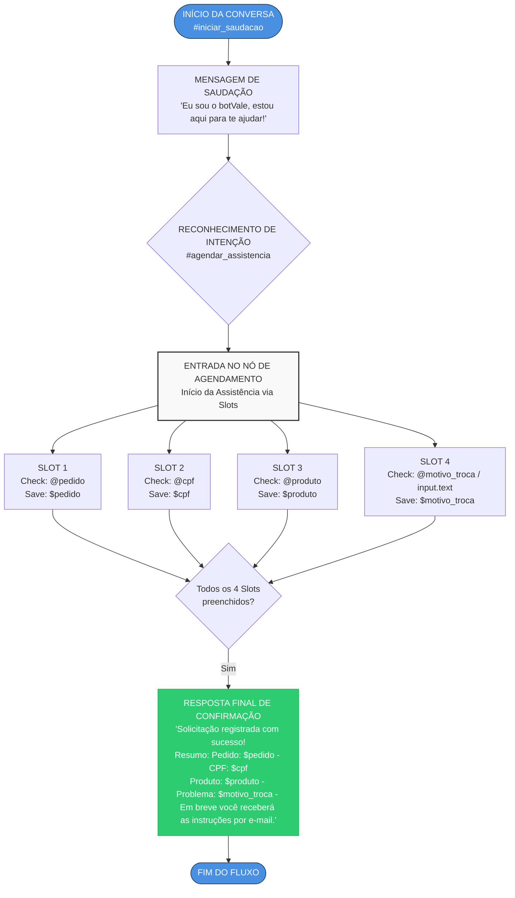

# 🤖 botVale - Chatbot de Pós-Venda (IBM Watson Assistant)

Chatbot de pós-venda criado no **IBM Watson Assistant** para registrar solicitações de assistência técnica e troca de produtos de forma automatizada.

## 📌 Funcionalidades

- Saudação inicial ao cliente
- Reconhecimento da intenção `#agendar_assistencia`
- Coleta de dados por **slots**:
  - `@pedido` → número do pedido
  - `@cpf` → CPF do cliente
  - `@produto` → produto envolvido
  - `@motivo_troca` → motivo da troca/problema
- Mensagem final de confirmação com resumo da solicitação

## 🔄 Fluxograma da conversa

## 🛠️ Tecnologias

- IBM Watson Assistant
- Mermaid (documentação do fluxo)

## 👨‍💻 Autor

Beatriz Fernandes - Curso de Análise e Desenvolvimento de Sistemas (ADS)
